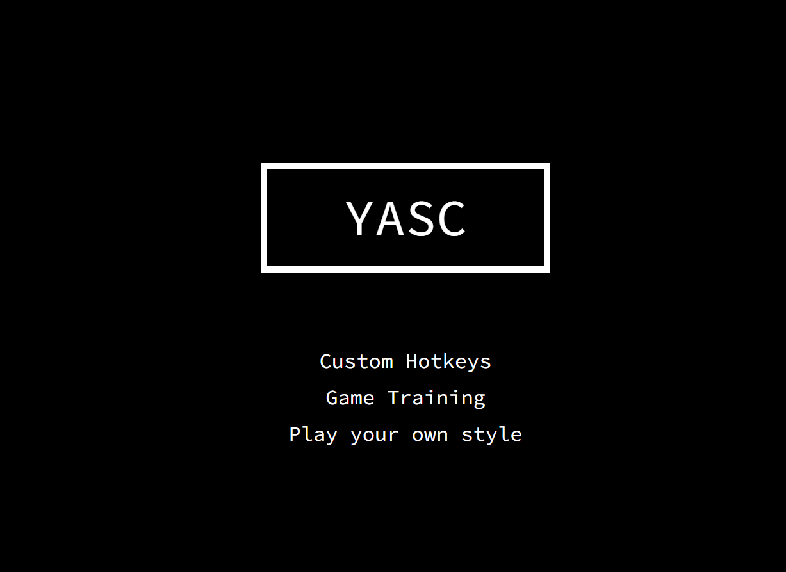

# YASC
The goal of the project is to to develop an interactive recorder performance tool, incorporating
Joy-Con controllers via a web interface for gesture-based inputs and SuperCollider for sound
synthesis.
<div>

<div>

## Video Introduction
https://youtu.be/O9uG8ymz72E

## Slides
https://github.com/yan-zhuang2/YASC/blob/main/Slides.pdf

## Table of Contents
- [Install and Run](#requirements)
- [Documentation](#overall-structure)
  - [Overall structure](#overall-structure)
  - [Website introduction](#website-introduction)
  - [SuperCollider introduction](#supercollider-introduction)
- [Source code organization](#dependency)
  - [Dependency](#dependency)
  - [File organization](#file-organization)
  - [Flute sound synthesis](#sound-synthesis-on-supercolliderrecorderscd)
- [Further improvement](#todo)


## Requirements
+ Node.js>=v16
+ SuperCollider software
+ Latest Edge (fully tested)

## Dependency Installation

```bash
cd /server
npm install
```
## Run the website and SuperCollider
1. Run server first.
```bash
node /server/index.js
```
2. Open the address shown in console. http://127.0.0.1:8081/
3. Open the file in /supercollider in SuperCollider and run the code (`Ctrl + Enter` on windows).
4. Follow the instructions on website and enjoy.

## Connect Joy-Con controllers to PC
Connect your Joy-Con controllers to PC via Bluetooth: click the button below until your PC detects and connects them.
<div>

<div>

## Overall Structure
The system tracks interaction with Joy-Con controllers and use their serial messages as input. The web system acts as the central interface, providing
users with an intuitive and interactive tool to set up and customize their performance experience. SuperCollider serves as sound synthesis engine: it generates the sound according to the commands sent from web system via Open Sound Control (OSC) protocol. Finally, the audio output can be captured by web system to provide a visual feedback.      
<div>

<div>

## Introduction of Joy-Con controllers
Joy-Con controllers consist of two individual units, each containing an analog stick, an array of buttons, a gyroscope and motion sensors (accelerometers). In this project, the left controller is used to control synthesis parameters and the right one is responsible for playing notes.
<div>

<div>

## Website Introduction
+ Welcome to our home page! On this page, you'll find three links to different functions.
+ <b>Clicking on the logo</b> allows you to connect your controllers to the web system.
+ You can also connect via <b>game-pad icon</b> on the top-left of the page.
<div>

<div>

+ Hotkey page: an interface to personalize your recorder experience. Through this page, <b>Joy-Con controller buttons can be mapped to different functions</b>.
+ The left controller is responsible for adjusting synthesis parameters in SuperCollider while the right controller is dedicated to play notes. 
+ Additionally, each motion of the Joy-Con controller can be captured and shown in the middle of the page: in this way, you can visually test the working condition of your devices. 
<div>

<div>

+ Dino game page: an interactive training tool designed to <b>help you familiarize with custom hotkeys</b>: the jumping action is triggered by the correct Joy-Con button (previously mapped in Hotkey Page). 
+ As the game progresses, the speed increases to raise the challenge level.
<div>

<div>

<div>

<div>

+ Performance page: an immersive audio-visual experience tool which <b>represents the output sound spectrum</b>.
+ Following the instructions, <b>click the button and share the entire screen and system audio</b>.
+ Additionally, a short Mario audio audio sample is prepared for beginners to follow.
<div>

<div>
<div>

<div>
<div>

<div>

## SuperCollider introduction
+ The recorder sound is generated by SuperCollider. Here's the simple GUI where you can edit some synthesis parameters and see the changes performed through Joy-Con controllers. 
<div>

<div>

## Dependency
+ Vue: provides a structure for building the GUI.
+ Vue Router: offers the capacity for routing locally.
+ joy-con-webhid: connect and parse Joy-Cons instructions(buttons, analog sticks, gyroscope and accelerometer sensors) based on WebHID.
+ osc: reading and writing OSC messages between website, server and SuperCollider.
+ meyda: used for sound analysis in performance page.
+ three: used for 3D graphics in performance page.
+ express: web framework for server, serving the website routes, static files.

## File Organization
+ server/: contains the server file that is used to serve the web pages.
+ supercollider/: contains the SC file that is used to generate sound.
+ html/src contains the main HTML, JavaScript, and CSS files that are used to render the web pages.
  + main.js is the main entry point for the web application. It defines the routes for the different pages in the application and imports the different components that are used to render the pages.
  + pages/ contains the different pages in the web application. Each page is a separate Vue.js component.
    + home.vue is the homepage of the website(navigation)
    + dino.vue is the main file of  Dino game page.
    + hotkeys.vue is main file the hotkey registration page.
    + stft.vue is the main file of performance page.
  + assets/ contains all static images that are used in the web application.
  + components/ contains the common components.
    + The reset.css file resets the default CSS styling of the web browser. 
    + The global.css file defines the global CSS styles for the web application. 
    + pure-min.css is a css library, used for basic form style in the hotkey.vue.
    + hotkey.js includes default configs for hotkey.vue.
    + control.js includes the map to Joy-con controllers, used for parsing and capture actions.
    + utils.js contains common js methods.
    + joy-con/ is used for connecting Joy-Con controllers, it didn't install via npm cause its content changed a bit for adopting "import".

## Sound synthesis on supercollider/recorder.scd
+ https://github.com/yan-zhuang2/YASC/blob/main/supercollider/recorder.scd
+ The main synthesis part is 'waveguideFlute', which follows Perry Cook’s recorder model.
  <div>
  
  <div>
+ The initial sound (sum1) is generated through a clipped noise modulated by an envelope and summed with a low frequency sinusoidal oscillator to simulate vibrato.
+ The second sound (sum2) is obtained as the sum of the first one and the actual output processed by a cubic interpolated delay line (used for bore effect emulation), modulated by a coefficient smaller than one (to prevent instability in the feedback loop).
+ The second sound (sum2) is processed by another cubic interpolated delay line and the cubic polynomial x minus 3 to the power of x is computed for each sample: this result is then summed to the actual output  modulated by a new small coefficient.
+ Finally, a low-pass filter is applied to the sound.( simulate the natural decay of high frequencies in a flute).

## ToDo
+ Implement features that allow users to record, save, and replay their performances.
+ The waveguide model doesn’t behave well at high frequencies. In the short future, multi-modal or multi-dimensional models could be adopted to solve the issue.
+ Offer more sophisticated sound parameters for users to manipulate in SuperCollider.
+ More accurate results might be achieved by incorporating higher-order non-linearities to simulate the wave bouncing behaviour in the real instrument.
